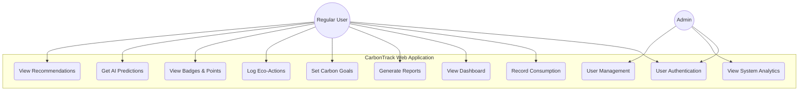
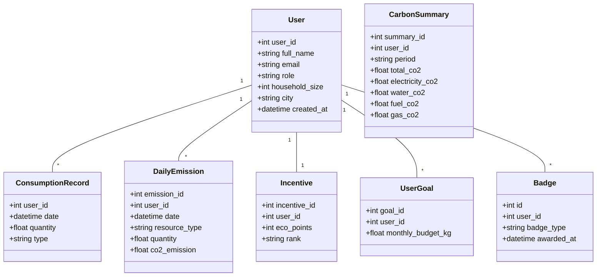
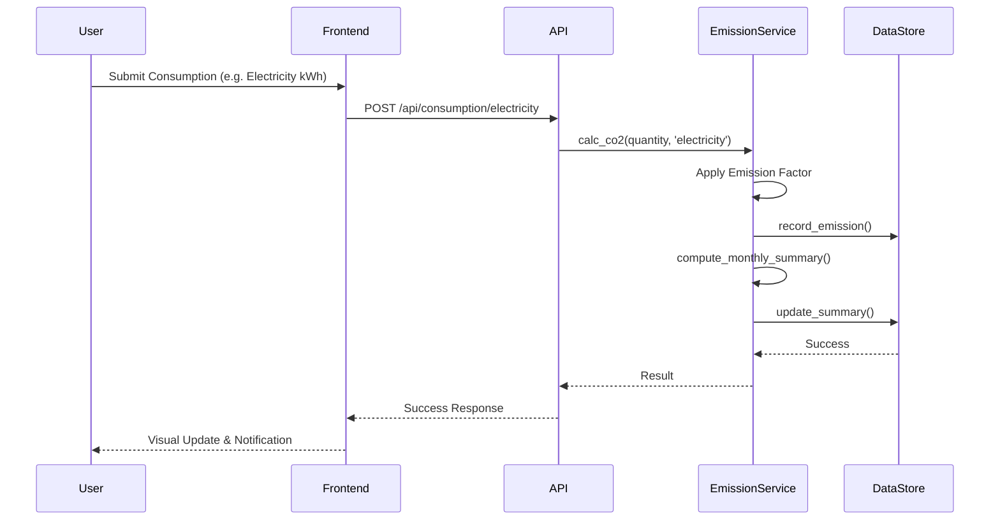
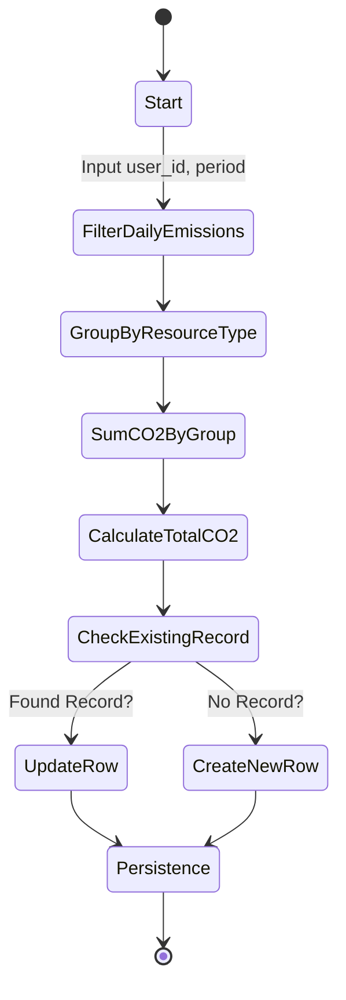

# 🌱 CarbonTrack (v3.0) – Smart Household Carbon Tracking platform

CarbonTrack is a next-generation sustainability analytics platform designed to monitor, analyze, and offset household carbon emissions. By tracking resource consumption patterns—including electricity, water, transportation fuel, and cooking gas—CarbonTrack provides actionable insights and gamified incentives to help users achieve a carbon-neutral lifestyle.

---

## 📌 Project Objective

The primary objective of CarbonTrack v3.0 is to:

- **Quantify Environmental Impact**: Real-time monitoring of household carbon footprints.
- **AI-Driven Personalization**: Generate tailored recommendations and predictive CO2 trends.
- **Gamified Sustainability**: Encourage sustainable habits through eco-points, badges, and national leaderboards.
- **Aggregated Analytics**: Provide comparative peer analysis and community-wide emission trends.
- **Automated Reporting**: Generate professional-grade sustainability reports in PDF/JSON formats.

---

## 🏗 System Architecture & Visualization

CarbonTrack v3.0 follows a robust modular architecture, integrating a FastAPI backend, a ReactJS frontend, and an intelligent data persistence layer.

### 1. Use Case Diagram
Detailed interaction between Regular Users and Administrators.



### 2. Class Diagram
Core data entities and their underlying relationships.



### 3. Sequence Diagram: Recording Consumption
Visualizing the data flow during an emission logging event.



### 4. Activity Diagram: Monthly Consolidation
Logic for recalculating monthly aggregates and budget tracking.



---

## 🔑 Key Features (v3.0)

- **Gamification Suite**: Earn Eco-Points and dynamic Badges for low-carbon streaks and sustainability tasks.
- **Smart Budgeting**: Set monthly CO2 limits and receive proactive "Warning" alerts as you approach thresholds.
- **Eco-Action Trackers**: Log specific positive actions (e.g., composting, LED upgrades) to see direct carbon offsets.
- **Advanced Visualization**: Interactive bar, pie, and line charts for historical trend analysis.
- **Peer Benchmarking**: Compare your footprint with city averages and top performers in your region.
- **Localized Insights**: Integration with local weather data (e.g., Mumbai today) to provide relevant energy-saving tips.

---

## 📸 Application Screenshots (Week 7)

| | |
|---|---|
|  <br> *Sleek, Dark-themed Login* |  <br> *Automated Sustainability PDF Report* |
|  <br> *User Dashboard & Nature Equivalents* |  <br> *Gamified Task Checklist & Forecasts* |
|  <br> *Historical Emission Trends* |  <br> *Global Sustainability Leaderboard* |

---

## 📁 Project Structure

```
carbon-frontend/
├── src/
│   ├── components/       # UI Components (Charts, Modals, etc.)
│   ├── pages/            # View Layers (Dashboard, History, etc.)
│   ├── App.jsx           # Routing logic
│   └── global.css        # Premium Dark UI Styling
```

```
carbon-backend/
├── app/
│   ├── api/routes/       # REST API Endpoints
│   ├── services/         # Business Logic (CO2 Calcs, Incentives)
│   ├── core/             # Security, Persistence, Config
│   └── main.py           # Application Entry Point
├── data/                 # CSV-based persistence layer
└── requirements.txt      # System dependencies
```

---

## ▶️ Setup & Installation

### Backend
```bash
cd carbon-backend
pip install -r requirements.txt
uvicorn app.main:app --reload
```

### Frontend
```bash
cd carbon-frontend
npm install
npm run dev
```

---

## 👨‍💻 Contributors

Project developed as part of **Software Engineering** coursework. 
*Latest update: Week 7 Documentation Cycle (v3.0)*